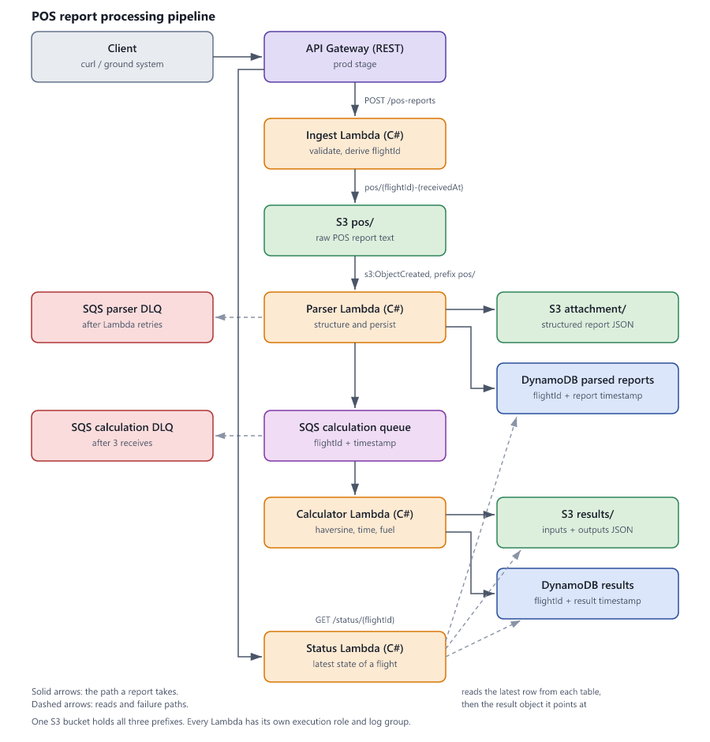

# POS report processing pipeline

A serverless pipeline that receives aircraft position (POS) reports over HTTP, stores the raw
message, parses it into a structured record, estimates the flight's remaining time and fuel at
arrival, and lets a caller check the status of a flight at any time.

The Lambda handlers are C# (.NET 8). The infrastructure is AWS CDK in TypeScript, and
`cdk deploy` builds the C# and deploys everything — nothing is created by hand in the console.

---

## Contents

- [What it does](#what-it-does)
- [Architecture](#architecture)
- [The POS report format](#the-pos-report-format)
- [API](#api)
- [What gets stored](#what-gets-stored)
- [Repository layout](#repository-layout)
- [Running and testing locally](#running-and-testing-locally)
- [Deploying](#deploying)
- [Testing the deployed stack](#testing-the-deployed-stack)
- [Failure handling](#failure-handling)
- [Key decisions and trade-offs](#key-decisions-and-trade-offs)
- [Assumptions](#assumptions)
- [What I would add next](#what-i-would-add-next)

---

## What it does

An aircraft sends a line of text like this:

```
POS/UL204.FR RGN/TO BKK/041205/N1642.3E09612.5/450/12500/2800
```

Four Lambdas handle it, each doing one thing:

| Lambda | Trigger | What it does |
| --- | --- | --- |
| **Ingest** | `POST /pos-reports` | Checks the message is well formed, derives the flight ID, writes the raw text to `s3://…/pos/`, replies with the flight ID |
| **Parser** | S3 object created under `pos/` | Parses the message, writes the structured JSON to `attachment/`, writes a row to the parsed-reports table, puts a message on the calculation queue |
| **Calculator** | Message on the calculation queue | Loads the parsed report, works out distance, remaining flight time and fuel at arrival, writes the result to `results/` and to the results table |
| **Status** | `GET /status/{flightId}` | Returns the latest known state of the flight |

The stages are joined by events rather than by calls, so the API responds as soon as the raw
message is safely stored, and a slow or failing calculation can never make ingest fail.

## Architecture



*(the same diagram as vector art: [docs/architecture.svg](docs/architecture.svg))*

One S3 bucket holds all three prefixes. The S3 event notification is scoped to `pos/`, so the
objects the pipeline writes to `attachment/` and `results/` cannot re-trigger the parser.

## The POS report format

```
POS/{IATA}{flightNumber}.FR {departure}/TO {destination}/{ddHHmm}/{lat}{lon}/{groundSpeed}/{fuelOnBoard}/{fuelFlow}
```

For the example message above:

| Field | Raw | Value |
| --- | --- | --- |
| Flight | `UL204` | SriLankan 204 |
| Route | `RGN` → `BKK` | Yangon to Bangkok |
| Day and time | `041205` | day 04 at 12:05 UTC |
| Latitude | `N1642.3` | 16 + 42.3/60 = **16.705** |
| Longitude | `E09612.5` | 96 + 12.5/60 = **96.2083** |
| Ground speed | `450` | 450 knots |
| Fuel on board | `12500` | 12 500 kg |
| Fuel flow | `2800` | 2 800 kg/h |

`S` and `W` produce the same number, negated.

**Flight ID.** The message carries a day but no year or month, so the year and month come from
the time the API received the request. With the example arriving on 4 September 2026:

```
flightId = UL204 + 20260904 + RGN + BKK = UL20420260904RGNBKK
```

## API

### `POST /pos-reports`

Body: the raw POS report as `text/plain`.

```bash
curl -X POST "$API_URL/pos-reports" \
  -H "Content-Type: text/plain" \
  --data "POS/UL204.FR RGN/TO BKK/041205/N1642.3E09612.5/450/12500/2800"
```

`200 OK`:

```json
{ "flightId": "UL20420260904RGNBKK", "status": "RECEIVED" }
```

`RECEIVED` means the raw message is stored; parsing and calculation happen asynchronously.

`400 Bad Request` when the body is missing, does not start with `POS/`, does not have eight
`/`-separated segments, or its flight, route or day/time fields are malformed:

```json
{ "message": "POS report must have 8 '/'-separated segments but had 7." }
```

### `GET /status/{flightId}`

```bash
curl "$API_URL/status/UL20420260904RGNBKK"
```

`200 OK` once the calculator has run:

```json
{
  "flightId": "UL20420260904RGNBKK",
  "timestamp": "2026-09-04T12:06:15.842Z",
  "remainingFlightTimeMinutes": 43,
  "estimatedFuelAtArrivalKg": 10513,
  "lowFuelWarning": false
}
```

While the calculator is still working, the same call returns what is known so far — the flight
and the timestamp of its latest report, without the calculated fields:

```json
{ "flightId": "UL20420260904RGNBKK", "timestamp": "2026-09-04T12:05:00Z" }
```

`404 Not Found` when nothing is known about the flight yet. **A 404 in the first moment after
posting a report is normal**, not an error: the report is stored, but the parser has not written
its row yet. Poll for a second or two.

A flight projected to run out of fuel comes back with `"lowFuelWarning": true`, and its row in
the results table is marked `LOW_FUEL_WARNING`.

## What gets stored

For the example message, received at `2026-09-04T15:12:30.123Z`:

**`pos/UL20420260904RGNBKK-2026-09-04T15:12:30.123Z`** — the raw text, exactly as received.

**`attachment/UL20420260904RGNBKK-2026-09-04T12:05:00Z.json`**

```json
{
  "flightId": "UL20420260904RGNBKK",
  "flightNumber": "UL204",
  "departure": "RGN",
  "destination": "BKK",
  "timestamp": "2026-09-04T12:05:00Z",
  "latitude": 16.705,
  "longitude": 96.2083,
  "groundSpeedKnots": 450,
  "fuelOnBoardKg": 12500,
  "fuelFlowKgPerHour": 2800
}
```

**Parsed-reports table** — partition key `flightId`, sort key `timestamp` (the report's time):

```json
{
  "flightId": "UL20420260904RGNBKK",
  "timestamp": "2026-09-04T12:05:00Z",
  "attachment": "attachment/UL20420260904RGNBKK-2026-09-04T12:05:00Z.json"
}
```

**`results/UL20420260904RGNBKK-2026-09-04T12:06:15.842Z.json`** — the calculation, carrying its
own inputs so it can be read without joining back to anything:

```json
{
  "flightId": "UL20420260904RGNBKK",
  "timestamp": "2026-09-04T12:06:15.842Z",
  "reportTimestamp": "2026-09-04T12:05:00Z",
  "input": {
    "currentLatitude": 16.705,
    "currentLongitude": 96.2083,
    "destination": "BKK",
    "destinationLatitude": 13.69,
    "destinationLongitude": 100.7501,
    "groundSpeedKnots": 450,
    "fuelOnBoardKg": 12500,
    "fuelFlowKgPerHour": 2800
  },
  "distanceNauticalMiles": 319.4,
  "remainingFlightTimeMinutes": 43,
  "estimatedFuelAtArrivalKg": 10513,
  "lowFuelWarning": false
}
```

**Results table** — partition key `flightId`, sort key `timestamp` (when the result was produced):

```json
{
  "flightId": "UL20420260904RGNBKK",
  "timestamp": "2026-09-04T12:06:15.842Z",
  "attachment": "results/UL20420260904RGNBKK-2026-09-04T12:06:15.842Z.json",
  "status": "CALCULATED",
  "reportTimestamp": "2026-09-04T12:05:00Z"
}
```

Both timestamps are ISO-8601 UTC, so the sort key orders rows by time and a
`ScanIndexForward: false, Limit: 1` query returns the newest row for a flight without a scan.

### The calculation

Great-circle distance by the haversine formula, flown at the current ground speed:

```
distance                   = haversine(current position, destination)   = 319.4 nm
remainingFlightTimeHours   = 319.4 / 450                                = 0.7097 h  -> 43 minutes
estimatedFuelAtArrivalKg   = 12500 - (2800 x 0.7097)                    = 10 513 kg
```

If the fuel at arrival is negative, the result is flagged `lowFuelWarning: true` and the row in
the results table is marked `LOW_FUEL_WARNING`.

This is the simplified model the exercise asks for. It ignores wind, routing, climb and descent,
diversions and reserves, so it is not an operational figure.

## Repository layout

```
.
├── docs/                          Architecture diagram (SVG source and PNG)
├── infra/                         CDK app (TypeScript)
│   ├── bin/pos-report-pipeline.ts     App entry point
│   ├── lib/pos-report-pipeline-stack.ts   All AWS resources and IAM
│   ├── lib/dotnet-function.ts         Reusable C# Lambda construct, builds the project
│   └── test/                          Assertions over the synthesised template
├── scripts/smoke-test.sh          End-to-end check against a deployed stack
└── src/                           .NET solution
    ├── PosPipeline.Core/              Domain and application logic. No AWS dependency
    │   ├── Parsing/                       POS report and coordinate parsing
    │   ├── Calculations/                  Haversine, airport directory, flight calculator
    │   ├── Contracts/                     The JSON documents this system reads and writes
    │   ├── Ports/                         Interfaces the use cases depend on
    │   └── UseCases/                      One class per stage of the pipeline
    ├── PosPipeline.Aws/               S3, DynamoDB, SQS adapters and the composition root
    ├── PosPipeline.IngestApi/         Lambda: POST /pos-reports
    ├── PosPipeline.Parser/            Lambda: S3 event
    ├── PosPipeline.Calculator/        Lambda: SQS event
    ├── PosPipeline.StatusApi/         Lambda: GET /status/{flightId}
    └── PosPipeline.Tests/             xUnit tests
```

The shape is deliberate: everything worth testing lives in `PosPipeline.Core`, which knows
nothing about AWS, so the parsing, the geometry and the flow between stages are all covered by
tests that run in under a second with no cloud account. Each Lambda project is a thin adapter
that translates an AWS event into a use case call and back.

## Running and testing locally

### Prerequisites

| Tool | Version | Notes |
| --- | --- | --- |
| .NET SDK | 8.0 or newer | A newer SDK is fine; the projects target `net8.0` |
| Node.js | 18 or newer | For the CDK app |
| AWS CLI | v2 | Only needed to deploy |
| Docker | optional | Only used if the .NET SDK is missing at deploy time |

### The C# tests

```bash
cd src
dotnet test
```

68 tests covering the parser (including the malformed messages that must produce a 400), the
degrees/minutes conversion in all four hemispheres, the haversine distance, the fuel and time
calculation, and each use case against in-memory doubles for S3, DynamoDB and SQS.

`PipelineWalkthroughTests` runs all four stages in order against those doubles, which is the
fastest way to see the whole flow — and to check a change end to end before deploying:

```bash
dotnet test --filter PipelineWalkthroughTests
```

### The infrastructure tests

```bash
cd infra
npm install
npm test
```

These synthesise the stack and assert the things that are easy to break without noticing: the
S3 trigger's prefix filter, the dead-letter queues, the table keys, the partial-batch failure
setting, and that no policy in the stack grants an action on `*`.

> The first run compiles the four C# projects, so it takes about a minute. Later runs reuse the
> build output.

### Emulating the cloud

There is no LocalStack or SAM setup here on purpose. The AWS-specific code is four small adapter
classes that are thin wrappers over single SDK calls; emulating AWS to test them costs more than
it finds, while everything above them is already tested. The remaining risk — IAM, triggers and
wiring — is what the CDK tests and the smoke test cover.

## Deploying

```bash
cd infra
npm install

# once per account/region
npx cdk bootstrap

npx cdk deploy
```

`cdk deploy` builds the C# projects itself. It runs `dotnet publish` on the host when the .NET
SDK is available and falls back to the `public.ecr.aws/sam/build-dotnet8` container when it is
not, so a machine with only Docker can still deploy.

Credentials and region come from the usual AWS CLI configuration:

```bash
export AWS_PROFILE=your-profile
export AWS_REGION=ap-southeast-1
```

The stack is called `PosReportPipeline` by default. To deploy more than one copy into an
account, pass a different name — resource names are derived from it:

```bash
npx cdk deploy -c stackName=PosReportPipelineDev
```

The outputs include the API URL, the bucket and table names, the queue URLs, and a ready-to-run
`curl` command for the example report.

### Removing it

```bash
npx cdk destroy
```

The bucket and both tables are created with `RemovalPolicy.DESTROY`, and the bucket empties
itself on delete, so nothing is left behind and nothing keeps costing money. A production stack
would retain all three.

### Cost

Everything here is within the AWS Free Tier for an account of any age except S3 storage, which
is free for the first 12 months and pennies per month afterwards for objects this small.

## Testing the deployed stack

```bash
./scripts/smoke-test.sh
```

It reads the API URL from the stack outputs, posts the example report, then polls the status
endpoint until the calculation appears. Pass an API URL as the first argument to skip the
CloudFormation lookup, or set `MESSAGE=…` to send a different report.

Or by hand:

```bash
API_URL=$(aws cloudformation describe-stacks --stack-name PosReportPipeline \
  --query "Stacks[0].Outputs[?OutputKey=='ApiUrl'].OutputValue" --output text)

curl -X POST "${API_URL}pos-reports" -H "Content-Type: text/plain" \
  --data "POS/UL204.FR RGN/TO BKK/041205/N1642.3E09612.5/450/12500/2800"

curl "${API_URL}status/UL20420260904RGNBKK"
```

On Windows PowerShell, use `Invoke-RestMethod`:

```powershell
$api = "https://xxxx.execute-api.ap-southeast-1.amazonaws.com/prod/"
Invoke-RestMethod -Method Post -Uri "${api}pos-reports" -ContentType "text/plain" `
  -Body "POS/UL204.FR RGN/TO BKK/041205/N1642.3E09612.5/450/12500/2800"
Invoke-RestMethod -Uri "${api}status/UL20420260904RGNBKK"
```

Useful things to try:

| Message | What happens |
| --- | --- |
| `POS/UL204.FR RGN/TO SIN/041205/N1642.3E09612.5/450/5000/8000` | Singapore is out of range on that fuel: `lowFuelWarning: true` |
| `POS/UL204.FR RGN/TO BKK/041205/N1642.3E09612.5/450/12500` | Seven segments: `400` |
| `POS/UL204.FR RGN/TO ZZZ/041205/N1642.3E09612.5/450/12500/2800` | Accepted and parsed, but the destination is unknown, so the calculation fails and the message ends up on the calculation dead-letter queue |

## Failure handling

| Failure | What happens |
| --- | --- |
| Malformed body on `POST /pos-reports` | `400` with the reason. Nothing is written |
| S3 write fails during ingest | `500`. The caller can retry; nothing partial was recorded |
| Message in S3 cannot be parsed | Logged as an error and dropped. Retrying would parse the same bytes, so the raw object is left in `pos/` for investigation instead |
| Parser fails on S3, DynamoDB or SQS | The exception propagates, Lambda retries the event twice, and it then goes to the parser dead-letter queue |
| Parser runs twice for one object | Harmless. Every write is keyed by flight ID and report timestamp, so a repeat overwrites rather than duplicates |
| Calculation fails for one message in a batch | Only that message is returned to the queue (`reportBatchItemFailures`); the rest of the batch is not reprocessed |
| Calculation keeps failing | After 3 receives SQS moves the message to the calculation dead-letter queue, where it is kept for 14 days |
| Queued report is not in the table yet | Treated as transient and retried; DynamoDB is read with `ConsistentRead` so this should not normally happen |
| Destination is not in the airport directory | The message fails and ends up on the dead-letter queue, with the unknown code in the log |
| Status requested before the parser has run | `404`, which is the expected answer for the first moment after a report is posted |

Both dead-letter queues are stack outputs, so investigating one is a `receive-message` away.

## Key decisions and trade-offs

**Hexagonal shape, with the domain in the middle.** `PosPipeline.Core` holds the parsing, the
maths and the use cases, and depends on interfaces (`IObjectStore`, `IParsedReportRepository`,
`ICalculationQueue`, `IClock`) rather than on the AWS SDK. `PosPipeline.Aws` implements those
interfaces, and each Lambda is a handler that maps an event onto a use case. The point is
testability: the interesting behaviour is exercised in milliseconds by ordinary unit tests, and
adding a second transport later (a Kinesis stream, say) means one new adapter, not a rewrite.

**The parser reads the flight ID and receive time back out of the S3 key.** The flight date has
to be invented from the current year and month, so ingest and parser could disagree if the two
ran either side of midnight on the last day of a month. Since the ingest key already contains
both the flight ID and the exact receive time, the parser takes them from there rather than
looking at its own clock. That also makes reprocessing an old object deterministic: parsing the
same key twice, a month later, still produces the same record.

**Two entry points into the parser.** The ingest API only validates the shape and the fields it
needs for the flight ID; the parser reads the whole message. A report with a corrupt fuel field
is therefore accepted (it is a real report about a real flight) and fails later where it can be
investigated, rather than being rejected with a `400` for a field the API never uses.

**Ingest answers `200` with a `RECEIVED` body.** `202 Accepted` would describe the situation
more precisely, since the work is not finished when the call returns, but the exercise specifies
this response and matching it exactly is worth more than the nuance. The `RECEIVED` status in the
body carries the same meaning.

**Status is derived from the two tables, not stored.** There is no third "state" table to keep in
step: the status endpoint queries the results table and falls back to the parsed-reports table,
returning the calculated fields only once a result exists. `RECEIVED` is what ingest returns; it
is not persisted, because writing it would mean a DynamoDB write on the hot path for information
the caller already has.

**The result object repeats its inputs.** It costs a few hundred bytes and means a result can be
audited on its own — with the destination coordinates and the position it was computed from —
without joining back to the parsed report, which may since have been superseded by a newer one.

**IAM is written by hand, statement by statement.** No `grantReadWrite`, no
`AWSLambdaBasicExecutionRole`. Each function gets its own role whose only starting permission is
writing to its own log group, and then exactly the actions it needs on exactly the ARNs it needs:
ingest may `s3:PutObject` under `pos/*` and nothing else — it cannot even read back what it
wrote. The one exception is CDK's own custom-resource providers (the S3 notification handler and
the bucket auto-emptier), which attach the AWS managed basic execution policy; those are CDK
internals rather than application code, and the second disappears if the bucket is retained
instead of auto-emptied.

**One bucket, three prefixes.** The lifecycle of the three kinds of object is the same and they
belong to the same domain, so three buckets would be ceremony. Prefix-scoped IAM keeps the
separation that matters, and the event notification is filtered to `pos/` so the pipeline cannot
feed itself.

**ARM64 and .NET 8.** Graviton is cheaper per millisecond and the published assemblies are
portable IL, so nothing architecture-specific is needed. `net8.0` is the newest .NET with a
managed Lambda runtime that any reviewer's SDK can also build; moving to a newer one is a change
to `TargetFramework` in `src/Directory.Build.props` and `RUNTIME` in `infra/lib/dotnet-function.ts`.

**Logging is deliberately sparse.** One line per successful stage with the identifiers needed to
follow a report through, warnings for the two situations worth noticing (a low-fuel projection,
a flight ID that disagrees with its key), and errors with the exception attached. Lambda's JSON
log format is on, so CloudWatch Logs Insights can filter by level rather than by string.

**No authentication on the API.** Out of scope for the exercise, and I did not want to hand over
a stack that needs credentials to try. It is the first thing I would add — see below.

## Assumptions

1. **The receiving system supplies the year and month.** The message has no year or month, so
   the pipeline takes both from the moment the API received the request. A report received on
   1 October that carries day 30 is therefore dated 30 October, not 30 September. Handling that
   properly needs a rule the message alone cannot supply (for example, "a day in the future by
   more than a day belongs to the previous month"), so I kept the specified behaviour and made
   it explicit here. A day that does not exist in the current month is rejected with a `400`.
2. **Coordinates are rounded to four decimal places** (about 11 m), which matches the worked
   example and is far finer than the source data, whose minutes have one decimal.
3. **Reported values are whole units**: minutes for time, kilograms for fuel. With full
   precision throughout, the example works out to 42.58 minutes and 10 512.8 kg, which round to
   the 43 minutes and 10 513 kg in the specification.
4. **The airport directory is a hardcoded table** of fourteen codes, covering the region in the
   example plus the codes used in the tests. It lives behind one type, so replacing it with a
   navigation database is a local change.
5. **A ground speed of zero is invalid**, since remaining flight time is undefined. A report on
   stand would fail the calculation and land on the dead-letter queue.
6. **One POS report produces one result.** Reports are not deduplicated: SQS delivers at least
   once, so a redelivered message can produce a second result row for the same report, with a
   later result timestamp. The status endpoint always reads the newest, so callers see a correct
   answer either way. Making it exactly-once would mean a conditional write keyed on the report
   timestamp; I left it out because the exercise's key format asks for the generation time.
7. **Callers already know the flight ID**, as the exercise states. There is no "list flights"
   endpoint.

## What I would add next

In the order I would do them:

1. **Authentication** on the API — IAM signing or a Cognito authorizer for the status endpoint,
   and mutual TLS or an API key for the aircraft-facing endpoint.
2. **Alarms** on both dead-letter queues, on Lambda errors, and on `LOW_FUEL_WARNING` results,
   which is the one output a human should hear about immediately rather than by polling.
3. **Idempotent results**, as described above, so a redelivered message cannot produce a second
   row.
4. **A TTL on the tables** and a lifecycle rule moving `pos/` objects to Glacier, since raw
   reports are kept for audit rather than for reading.
5. **Tracing** with X-Ray to follow one report across the four functions; I left it out here
   because its policy needs a wildcard resource, and the least-privilege constraint seemed worth
   more than the tracing.
